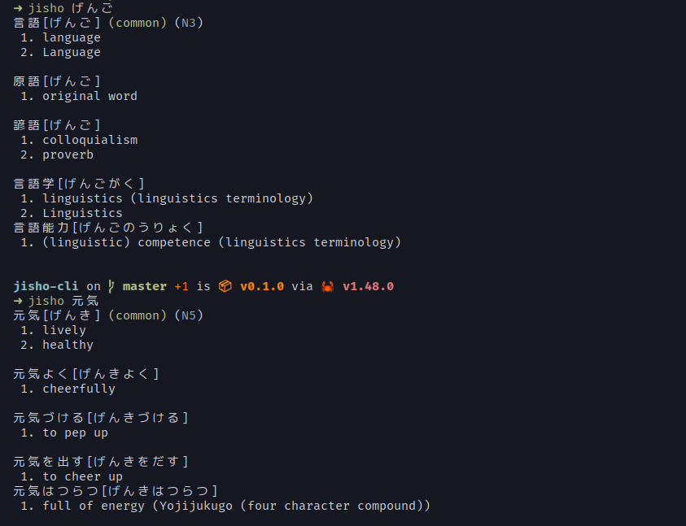

# Jisho (cli)
A very simple cli tool to look up Japanese words using jisho.org's API

<br>


# Installation

From my [Arch repository](https://repo.jojii.de)
```
sudo pacman -S jisho
```

From crates.io:
```
cargo install jisho-cli
```

From AUR:
```
yay -S jisho
```

<br>

# Usage
```
jisho [<words to look up>]
```

> Note: The binary from crates.io is called `jisho-cli`, not `jisho` <br>
> Note: You can use spaces
